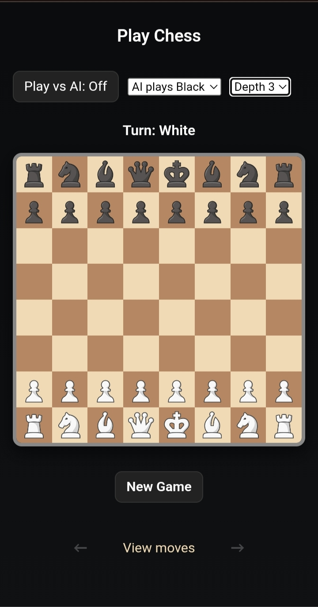

# Chess Game

A fully interactive web-based Chess game built only using **HTML**, **CSS**, and **JavaScript**. You can play on a raw board or with an AI opponent.

---
# Live Preview
https://html-guy0.github.io/Chess/
---

# Features

- **Two Game Modes:** Raw board and Player vs AI.
- **Interactive Board:** click-to-move pieces.
- **Valid Moves Only:** Only legal moves are allowed; invalid moves are blocked automatically.
- **Visual Feedback:** Highlights selected piece, valid moves, and captures.
- **Check & Checkmate Detection:** Game recognizes check, checkmate, and stalemate conditions.
- **Responsive Design:** Optimized for different screen sizes.
- **Lightweight:** No external dependencies or libraries required.
- **Changable Pieces:** You can change pieces images yourself replacing images from the pieces folder.
- **Restart & Mode Switch Buttons:** Quickly start a new game or switch game mode.
- **Pawn Promotion:** Automatically prompts for promotion choice when a pawn reaches the back rank.
- **Intelligent AI:** Play with the AI  that evaluates board positions to make strategic moves with the moves depths from 1 to 5.
- **Minimal Load Time:** Fast performance even on mobile browsers because of low size.

---

## AI Details

- The AI evaluates possible moves and assigns scores based on piece value and position.
- The AI's maximum depth is 5 which you can select yourself
- It can make you better at chess, its not too much powerful but is good.

---

# Special
- All of the chess rules are made only with one JavaScript file.
- The AI is made also in the same file (script.js).
- The board is Clean and looks same as Chess.com's board.
- There's no errors :)
